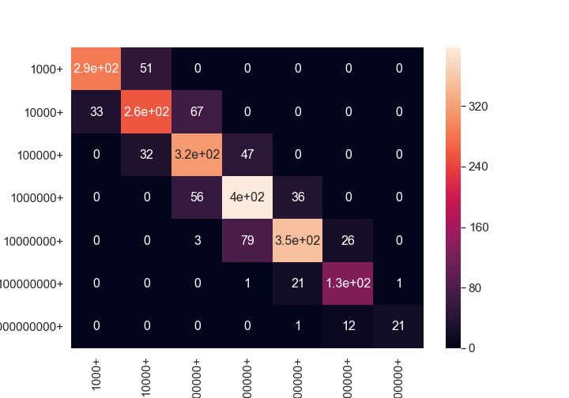

# Model to predict Google App Install

## Tools Used
Tools / Technologies used: 
Python, KNN (k-nearest neighbors),Random forest (Machine Learning Model),XGBoost,XGBoost with Cross Validation, Naive Bayes classifier.

   

            

The best model to predict Installs of Google App is XGBoost. The best score we could achieved is 0.79.

The Confusion Matrix for this model is 

We used Tableau for Data Visulazation. Here is the link to tableau.
https://public.tableau.com/profile/becky.li#!/vizhome/FinalGroupProject_15730964044550/Story1?publish=yes
