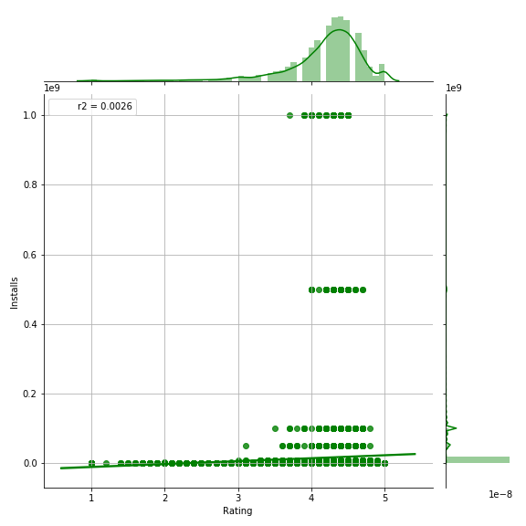

# Model to predict Google App Install

## Tools Used
Tools / Technologies used: 
Python, KNN (k-nearest neighbors),Random forest (Machine Learning Model),XGBoost,XGBoost with Cross Validation, Naive Bayes classifier.

                 

            
